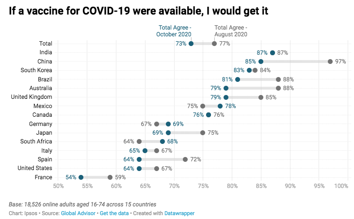
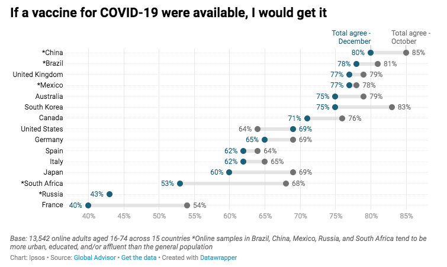

```{r setup, include=FALSE}
knitr::opts_chunk$set(echo = TRUE,
                      warning = FALSE,
                      message = FALSE,
                      fig.align = "center",
                      fig.width = 7,
                      fig.height = 5,
                      fig.showtext = TRUE
                      )
```

## Introduction
Towards the end of the third quarter of 2020, the idea of developing a COVID-19 vaccine was becoming a reality and people had lots of questions and concerns. Global interest in the material and infrastructure to distribute and supply COVID-19 doses was going to become top priority. The science community understood that the only way out of this pandemic was going to be through these life-saving vaccines, but the views of these country's population was a different story. Many had their own points of view and perspectives as to why they would, or would not get vaccinated - many worried about the side effects, and some just had outright opposition to them.

A simple but extremely effective tool to gather information is through a survey, so this is where my data analysis report begins. I will do my best to show, through data and data visualizations, how people across the globe progressed, or fell short of their initial opinion in their intentions to be inoculated against the COVID-19 virus once a vaccine was readily available.

Inspired by and designed after the series of R videos on the [Riffomonas YouTube page](https://www.youtube.com/@Riffomonas) by Pat Schloss, who is a professor in the Department of Microbiology and Immunology at the University of Michigan School of Medicine. 

## Purpose of Analysis
I will be analyzing 2020 vaccination intent percentages vs current (2023), in a number of countries through survey data via visualizations. We will discover which of these countries reached their intended vaccination rate or exceeded it vs. those that fell short or left behind.

## Data Sources
**I will be using a total of three(3) data sources:**

- [Ipsos August to October 2020](https://www.ipsos.com/en/global-attitudes-covid-19-vaccine-october-2020): Where they first surveyed approximately 13,000 individuals from 15 countries, from July 24^th^ - August 7^th^, 2020 and then surveyed another 18,000 individuals from October 8^th^ - October 13^th^, 2020 on their intent on receiving a Covid-19 vaccine. They then created a dumbbell plot showing each countries results and positive/negative change between the two surveys.

- [Ipsos October to December 2020](https://www.ipsos.com/en/global-attitudes-covid-19-vaccine-december-2020): Where the results from the above October 2020 survey were then plotted on a dumbbell plot against the results of surveying 13,542 individuals from 15 countries from December 17^th^ - December 20^th^, 2020, showing change in desire to get the vaccine.

- [Our World in Data](https://ourworldindata.org/) Covid-19 Data Explorer [CSV file dataset](https://covid.ourworldindata.org/data/owid-covid-data.csv): Which is updated daily with new coronavirus data on a number of categories. We will load in the csv dataset into a variable of its own and use that variable throught the analysis.

## Processing Data

### Loading necessary packages (library())
```{r}
library(tidyverse)
library(ggrepel)
library(glue)
library(patchwork)
library(ggtext)
library(showtext)
library(kableExtra)
library(knitr)
```

## August to October 2020 Survey Data

### Reading in Data
```{r}
data_aug_oct <- read_csv("aug_oct_2020/data-8KmKL.csv") %>% 
  rename(country = X.1,
         percent_august = "Total Agree - August 2020",
         percent_october = "Total Agree - October 2020")

data_aug_oct
```

### Adding a *bump* column to space out the position of percentage text on plot
```{r}
data_aug_oct <- read_csv("aug_oct_2020/data-8KmKL.csv") %>% 
  rename(country = X.1,
         percent_august = "Total Agree - August 2020",
         percent_october = "Total Agree - October 2020") %>% 
  mutate(bump_august = if_else(percent_august < percent_october,
                               percent_august - 2,
                               percent_august + 2),
         bump_october = if_else(percent_august < percent_october,
                                percent_october + 2,
                                percent_october - 2))

data_aug_oct
```

### Creating Main Body of our Dumbbell Plot
```{r}
main_plot_aug_oct <- data_aug_oct %>% 
  pivot_longer(cols = -country, names_to=c(".value","month"),
               names_sep="_") %>% 
  mutate(country = factor(country, levels = rev(data_aug_oct$country))) %>% 
  ggplot(aes(x=percent, y=country, color=month)) +
  geom_line(color="#e6e6e6", linewidth=1.75, show.legend=FALSE) +
  geom_point(size=2, show.legend=FALSE) +
  geom_text(aes(label=glue("{percent}%"), x=bump), size=3, show.legend=FALSE) +
  scale_color_manual(name=NULL,
                     breaks=c("august", "october"),
                     values=c("#727272","#15607a"),
                     labels=c("August","October")) +
  scale_x_continuous(limits=c(50, 100),
                     breaks=seq(50, 100, by=5),
                     labels=glue("{seq(50,100,5)}%")) +
  labs(x=NULL, y=NULL,
       title="If a vaccine for COVID-19 were available, I would get it",
       caption="<i>Base: 18,526 online adults aged 16-74 across 15 countries</i><br>Source: Ipsos") +
  theme(
    plot.title.position = "plot",
    plot.title = element_text(face="bold", margin=margin(b=20)),
    plot.caption = element_markdown(hjust=0, color="darkgray"),
    plot.caption.position = "plot",
    plot.background = element_rect(fill="#F8F8F8", color="#F8F8F8"),
    panel.background = element_rect(fill="#F8F8F8"),
    panel.grid = element_blank(),
    axis.ticks = element_blank(),
    axis.text.x = element_text(color="darkgray"),
    panel.grid.major.x = element_line(color="gray", linewidth=0.1),
    panel.grid.major.y = element_line(color="gray", linewidth=0.1, linetype="dotted")
  )

main_plot_aug_oct
```

### Creating data frame to use in labeling the top of **Total** percentage points
```{r}
total_aug_oct <- data_aug_oct %>% 
  filter(country == "Total") %>% 
  pivot_longer(cols = -country, names_to=c(".value","month"),
               names_sep="_") %>% 
  mutate(pretty = if_else(month == "august",
                          "Total Agree -<br>August 2020",
                          "Total Agree -<br>October 2020"),
         align = if_else(month == "august", 0, 1))

total_aug_oct
```

### August to October 2020 Dumbbell Plots (Click on the tabs to see recreated vs. original) {.tabset .tabset-fades .tabset-pills}

#### Recreated Dumbbell Plot in R
```{r}
main_plot_aug_oct +
  coord_cartesian(clip="off") +
  geom_textbox(data = total_aug_oct,
               aes(x=percent, y=country, color=month, label=pretty, hjust=align),
               size=2,
               box.color=NA,
               width = NULL,
               vjust=-0.5,
               box.padding=margin(0,0,0,0),
               fill=NA,
               show.legend=FALSE)
```

#### Actual Dumbbell Plot Image from Ipsos webpage
<center>



</center>


### Findings

#### Creating data frame to include in our table
```{r}
aug_oct_diff <- data_aug_oct %>% 
  mutate(diff_ao = percent_october - percent_august) %>% 
  select(country, contains("percent"), diff_ao) %>% 
  arrange(diff_ao)

aug_oct_diff
```

#### Building our table to observe changes in intent from August to October 2020
```{r}
colors_ao <- aug_oct_diff %>%
  mutate_at(4, 
            ~case_when(. < 0 ~ '#FF2E2E',
                       . == 0 ~ '#FFFF00',
                       TRUE ~ '#94C973'))

kable(aug_oct_diff, align="c") %>% 
  column_spec(4, color = "black", background=colors_ao$diff_ao) %>% 
  kable_styling(bootstrap_options = c("striped", "hover", "bordered"), full_width = FALSE)
```

What we see here:

- After surveying 18,526 adults from 15 countries, on average, 73% would get the COVID-19 vaccine if it were available. This is a drop of 4 points when they surveyed the same adults, three months earlier in August 2020 (77%).

- From our dumbbell plot and table, we see that 8 out of the 15 countries are above the total average of 73%, those countries being: India(87%), China(85%), South Korea(83%), Brazil(81%), Australia(79%), the United Kingdom(79%), Mexico(78%), and Canada(76%).

- The remaining 7 countries below the 15-country average are: Germany(69%), Japan(69%), South Africa(68%), Italy(65%), Spain(64%), the United States(64%), and France(54%).

- This table illustrates how vaccination intent in a three month period has dropped in 10 of the 15 countries, with China(dropping 12%) being the most, followed by Australia(dropping 9%), Spain(dropping 8%), and Brazil(dropping 7%).

- India and Canada made no change, while 3 countries went up in vaccination intent, but not by much: Germany(up 2%), Mexico(up 3%), and South Africa(up 4%).

## October to December 2020 Survey Data

### Reading in Data
```{r}
data_oct_dec <- read_csv("oct_dec_2020/data-TDEsC.csv") %>% 
  rename(country='X.1',
         percent_october='Total agree - October',
         percent_december = 'Total agree - December') %>% 
  mutate(country=str_replace_all(country, "\\*",""))

data_oct_dec
```

### Adding a **Total** row with the 15-country average intent for Oct. & Dec. 2020
```{r}
total_oct <- data_oct_dec %>% drop_na() %>% 
  summarize(mean_oct = round(mean(percent_october),0))

total_dec <- data_oct_dec %>% 
  summarize(mean_dec = round(mean(percent_december),0))

df_od <- data.frame("Total", total_oct, total_dec)
names(df_od) <- c("country", "percent_october", "percent_december")

df_od
```


### Adding a *bump* column to space out the position of percentage text on plot
```{r}
data_oct_dec <- tibble(rbind(df_od, data_oct_dec)) %>% 
  mutate(bump_october = if_else(percent_october < percent_december,
                                percent_october - 3,
                                percent_october + 3,),
         bump_december = if_else(percent_october < percent_december,
                                percent_december + 3,
                                percent_december - 3)) %>% 
  replace_na(list(bump_october=40, bump_december=40))

data_oct_dec
```

### Creating Main Body of our Dumbbell Plot
```{r}
main_plot_oct_dec <- data_oct_dec %>%
  pivot_longer(cols = -country, names_to=c(".value", "month"),
               names_sep = "_") %>% replace_na(list(percent=43)) %>%
  mutate(country = factor(country, levels = rev(data_oct_dec$country))) %>%
  ggplot(aes(x=percent, y=country, color=month)) +
  geom_line(color="#e6e6e6", linewidth=1.75, show.legend = FALSE) +
  geom_point(size=2, show.legend = FALSE) +
  geom_text(aes(label=glue("{percent}%"), x=bump),size=3, show.legend = FALSE) +
  scale_color_manual(name=NULL,
                     breaks=c("october", "december"),
                     values=c("#727272", "#15607a"),
                     labels=c("October", "December")) +
  scale_x_continuous(limits=c(35, 90),
                     breaks=seq(35, 90, by=5),
                     labels=glue("{seq(35, 90, 5)}%")) +
  labs(x=NULL, y=NULL,
       title="If a vaccine for COVID-19 were available, I would get it",
       caption="<i>Base: 13,542 online adults aged 16-74 across 15 countries</i><br>Source: Ipsos")+
  theme(
    plot.title.position = "plot",
    plot.title = element_text(face="bold", margin= margin(b=20)),
    plot.caption = element_markdown(hjust=0, color="darkgray"),
    plot.caption.position = "plot",
    plot.background = element_rect(fill="#F8F8F8", color="#F8F8F8"),
    panel.background = element_rect(fill="#F8F8F8"),
    panel.grid = element_blank(),
    axis.ticks = element_blank(),
    axis.text.x = element_text(color="darkgray"),
    panel.grid.major.x = element_line(color="gray", linewidth=0.1),
    panel.grid.major.y = element_line(color="gray", linewidth=0.1, linetype="dotted")
  )

main_plot_oct_dec
```

### Creating data frame to use in labeling the top of **Total** percentage points
```{r}
total_oct_dec <- data_oct_dec %>% 
  filter(country == "Total") %>% 
  pivot_longer(cols = -country, names_to=c(".value","month"),
               names_sep="_") %>% 
  mutate(pretty = if_else(month == "october",
                          "Total Agree -<br>October",
                          "Total Agree -<br>December"),
         align = if_else(month == "october", 0, 1))

total_oct_dec
```

### October to December 2020 Dumbbell Plots (Click on the tabs to see recreated vs. original) {.tabset .tabset-fades .tabset-pills}

#### Recreated Dumbbell Plot in R
```{r}
main_plot_oct_dec +
  coord_cartesian(clip="off") +
  geom_textbox(data = total_oct_dec,
               aes(x=percent, y=country, color=month, label=pretty, hjust=align),
               size=2,
               box.color=NA,
               width = NULL,
               vjust=-0.5,
               box.padding=margin(0,0,0,0),
               fill=NA,
               show.legend=FALSE)
```

#### Actual Dumbell Plot Image from Ipsos webpage
<center>



</center>


### Findings

#### Creating data frame to include in our table
```{r}
oct_dec_diff <- data_oct_dec %>% 
  replace_na(list(percent_october=43)) %>%
  mutate(diff_od = percent_december - percent_october) %>% 
  select(country, contains("percent"), diff_od) %>% 
  arrange(diff_od)

oct_dec_diff
```

#### Building our table to observe changes in intent from October to December 2020
```{r}
colors_od <- oct_dec_diff %>%
  mutate_at(4, 
            ~case_when(. < 0 ~ '#FF2E2E',
                       . == 0 ~ '#FFFF00',
                       TRUE ~ '#94C973'))

kable(oct_dec_diff, align="c") %>% 
  column_spec(4, color = "black", background=colors_od$diff_od) %>% 
  kable_styling(bootstrap_options = c("striped", "hover", "bordered"), full_width = FALSE)
```

What we see here:

- After the first Coronavirus vaccination was administered in mid-December 2020, 13,542 adults aged 16-74 were surveyed online across 15 countries to once again gauge their intent on getting the COVID-19 vaccine. On average, 66% of adults surveyed would get the vaccine(down 6% from October).

- From the dumbbell plot and table, we see that countries on the higher-end on intent on vaccinations are China(80%), Brazil(78%), Mexico(77%), and the United Kingdom(77%).

- On the other hand, countries on the lower-end are South Africa(53%), Russia(43%), and France(40%) - not a very good sign.

- Only one country actually had an increase in interest for a COVID-19 vaccine from October to December 2020, and that country was the United States(up 5%).

- Intent dropped drastically in South Africa(down 15%), France(down 14%), Japan(down 9%), and South Korea(down 8%). There are many factors that may have gone into play for these dramatic drops in vaccine interest, like fears of side effects or doubts in efficacy, but that's a question for a different data analysis project.

## Combining data to see overall change from August to December 2020 Survey Data

### Reading in Data
```{r}
data_aug_oct <- read_csv("aug_oct_2020/data-8KmKL.csv") %>% 
  rename(country = X.1,
         percent_august = "Total Agree - August 2020",
         percent_october = "Total Agree - October 2020")

data_oct_dec <- read_csv("oct_dec_2020/data-TDEsC.csv") %>% 
  rename(country='X.1',
         percent_october='Total agree - October',
         percent_december = 'Total agree - December') %>% 
  mutate(country=str_replace_all(country, "\\*",""))

data_aug_oct
data_oct_dec
```

### Joining the two dataframes
```{r}
data_aug_dec <- inner_join(data_aug_oct, data_oct_dec, by="country") %>% 
  select(-contains("october"))

data_aug_dec
```

### Adding a **Total** row with the 14-country average intent for Aug. & Dec. 2020
```{r}
total_aug <- data_aug_dec %>%
  summarize(mean_aug = round(mean(percent_august),0))

total_adec <- data_aug_dec %>% 
  summarize(mean_dec = round(mean(percent_december),0))

df_ad <- data.frame("Total", total_aug, total_adec)
names(df_ad) <- c("country", "percent_august", "percent_december")

df_ad
```

### Adding a *bump* column to space out the position of percentage text on plot
```{r}
data_aug_dec <- tibble(rbind(df_ad, data_aug_dec)) %>% 
  mutate(bump_august = if_else(percent_august < percent_december,
                               percent_august - 3,
                               percent_august + 3),
         bump_december = if_else(percent_august < percent_december,
                                percent_december + 3,
                                percent_december - 3))

data_aug_dec
```

### Creating Main Body of our Dumbbell Plot
```{r}
main_plot_aug_dec <- data_aug_dec %>%
  pivot_longer(cols = -country, names_to=c(".value", "month"),
               names_sep = "_") %>% replace_na(list(percent=43)) %>%
  mutate(country = factor(country, levels = rev(data_aug_dec$country))) %>%
  ggplot(aes(x=percent, y=country, color=month)) +
  geom_line(color="#e6e6e6", linewidth=1.75, show.legend = FALSE) +
  geom_point(size=2, show.legend = FALSE) +
  geom_text(aes(label=glue("{percent}%"), x=bump),size=3, show.legend = FALSE) +
  scale_color_manual(name=NULL,
                     breaks=c("august", "december"),
                     values=c("#727272", "#15607a"),
                     labels=c("August", "December")) +
  scale_x_continuous(limits=c(35, 100),
                     breaks=seq(35, 100, by=5),
                     labels=glue("{seq(35, 100, 5)}%")) +
  labs(x=NULL, y=NULL,
       title="If a vaccine for COVID-19 were available, I would get it",
       caption="<i>Base: Over 25,500 online adults aged 16-74 across 14 countries</i><br>Source: Ipsos")+
  theme(
    plot.title.position = "plot",
    plot.title = element_text(face="bold", margin= margin(b=20)),
    plot.caption = element_markdown(hjust=0, color="darkgray"),
    plot.caption.position = "plot",
    plot.background = element_rect(fill="#F8F8F8", color="#F8F8F8"),
    panel.background = element_rect(fill="#F8F8F8"),
    panel.grid = element_blank(),
    axis.ticks = element_blank(),
    axis.text.x = element_text(color="darkgray"),
    panel.grid.major.x = element_line(color="gray", linewidth=0.1),
    panel.grid.major.y = element_line(color="gray", linewidth=0.1, linetype="dotted")
  )

main_plot_aug_dec
```

### Creating data frame to use in labeling the top of **Total** percentage points
```{r}
total_aug_dec <- data_aug_dec %>% 
  filter(country == "Total") %>% 
  pivot_longer(cols = -country, names_to=c(".value","month"),
               names_sep="_") %>% 
  mutate(pretty = if_else(month == "august",
                          "Total Agree -<br>August 2020",
                          "Total Agree -<br>December 2020"),
         align = if_else(month == "august", 0, 1))

total_aug_dec
```

### August to December 2020 Dumbbell Plot
```{r}
main_plot_aug_dec +
  coord_cartesian(clip="off") +
  geom_textbox(data = total_aug_dec,
               aes(x=percent, y=country, color=month, label=pretty, hjust=align),
               size=2,
               box.color=NA,
               width = NULL,
               vjust=-0.5,
               box.padding=margin(0,0,0,0),
               fill=NA,
               show.legend=FALSE)
```

### Findings

#### Creating data frame to include in our table
```{r}
aug_dec_diff <- data_aug_dec %>% 
  mutate(diff_ad = percent_december - percent_august) %>% 
  select(country, contains("percent"), diff_ad) %>% 
  arrange(diff_ad)

aug_dec_diff
```

#### Building our table to observe changes in intent from October to December 2020
```{r}
colors_ad <- aug_dec_diff %>%
  mutate_at(4, 
            ~case_when(. < 0 ~ '#FF2E2E',
                       . == 0 ~ '#FFFF00',
                       TRUE ~ '#94C973'))

kable(aug_dec_diff, align="c") %>% 
  column_spec(4, color = "black", background=colors_ad$diff_ad) %>% 
  kable_styling(bootstrap_options = c("striped", "hover", "bordered"), full_width = FALSE)
```

What we see here:

- Survey data from August to December 2020, of approximately 25,500 adults 16-74 years of age, shows that overall vaccination interest went down 9%, from 76% to 67%.

- From the dumbbell plot and table, 12 of the 14 countries from August to December 2020 have had a drop in vaccination intent - some more drastic than others.

- France having the largest decline going from 59% in August to 40% in December(drop of 19%), others in this category are China(drop of 17%), Japan(drop of 15%), and Australia(drop of 13%).

- Only 2 out of the 14 countries had an actual increase in COVID-19 vaccination intent, those being Mexico and the United States, both up 2%.

## Comparing December 2020 Vaccine Intent Data to Current Actual Vaccination Data

### Loading text fonts from Google
```{r}
font_add_google(family = "playfair", "Playfair Display")
font_add_google(family = "montserrat", "Montserrat")

showtext_auto()
```

### Loading in Data

#### Reading *CSV* file directly from the website updated daily with new data
```{r}
owid <- read_csv("https://covid.ourworldindata.org/data/owid-covid-data.csv") %>% 
  select(country = location,
         date,
         all_vax = people_vaccinated_per_hundred, 
         fully_vax = people_fully_vaccinated_per_hundred) %>%
  drop_na(fully_vax) %>% 
  group_by(country) %>% 
  slice_max(date, n=1) %>% 
  ungroup() %>% 
  select(-date)

owid
```

- *people_vaccinated_per_hundred* column represents strictly the number of vaccinations given to the population

- *people_fully_vaccinanted_per_hundred* column represents number of people who have take two(2) or more doses of the COVID-19 vaccine

#### Joining datasets
```{r}
data_aug_oct <- read_csv("aug_oct_2020/data-8KmKL.csv") %>% 
  rename(country = X.1,
         percent_august = "Total Agree - August 2020",
         percent_october = "Total Agree - October 2020")

data_oct_dec <- read_csv("oct_dec_2020/data-TDEsC.csv") %>% 
  rename(country='X.1',
         percent_october='Total agree - October',
         percent_december = 'Total agree - December') %>% 
  mutate(country=str_replace_all(country, "\\*",""))

ipsos <- inner_join(data_aug_oct, data_oct_dec, by="country") %>% 
  select(-contains("october"))

ipsos

ipsos_owid <- inner_join(owid, ipsos, by = "country") %>% 
  mutate(diff = fully_vax-percent_december,          # or diff in fct_reorder 
         country = fct_reorder(country, -diff),     # function to show opposite, this alone allow the plots to be descending
         country = recode(country,
                          "United States" = "USA",
                          "United Kingdom" = "UK",
                          "South Korea" = "S. Korea",
                          "South Africa" = "S. Africa"))

ipsos_owid
```

### Creating our Dot Plot and Dumbbell Plot

#### Dot Plot
```{r}
dot <- ipsos_owid %>% 
  ggplot(aes(x=diff, y=country)) +
  geom_hline(aes(yintercept=country), color="gray", linewidth=0.25) +
  geom_point() +
  geom_vline(xintercept = 0) +
  labs(x="Difference between actual\nand intended vaccination rate",
       y=NULL) +
  theme_classic() +
  theme(
    plot.background = element_rect(fill="#F8F8F8", color="#F8F8F8"),
    panel.background = element_rect(fill="#F8F8F8"),
    panel.grid = element_blank(),
    text = element_text(family = "montserrat"),
    axis.ticks.y = element_blank(),
    axis.title.x = element_text(size=10)
  )

dot
```

#### Dumbbell Plot
```{r}
dumbbell <- ipsos_owid %>% 
  select(country, actual=fully_vax, intended=percent_december) %>% 
  pivot_longer(cols=c(actual, intended), names_to="status", values_to="percent") %>% 
  mutate(status = factor(status, levels=c("intended", "actual"))) %>% 
  ggplot(aes(x=percent, y=country, group=country, color=status)) +
  geom_hline(aes(yintercept=country), color="gray", linewidth=0.25) +
  geom_path(arrow=arrow(ends="first", angle=20, length=unit(0.1, "inches"), type="closed"), color="black") +
  labs(x="2020 intended and 2023\nactual vaccination rates",
       y=NULL) +
  theme_classic() +
  theme(
    text = element_text(family = "montserrat"),
    plot.background = element_rect(fill="#F8F8F8", color="#F8F8F8"),
    panel.background = element_rect(fill="#F8F8F8"),
    panel.grid = element_blank(),
    axis.text.y = element_blank(),
    axis.title.y = element_blank(),
    axis.ticks.y = element_blank(),
    axis.line.y = element_blank(),
    axis.title.x = element_text(size=10)
  )

dumbbell
```

#### Combining plots using *patchwork* package
```{r}
dot + dumbbell +
  plot_annotation(
    title="Countries are doing a pretty good job at meeting their people's stated desire to receive the COVID-19 vaccine",
    theme=theme(
      plot.background = element_rect(fill="#F8F8F8", color="#F8F8F8"),
      panel.background = element_rect(fill="#F8F8F8"),
      panel.grid = element_blank(),
      plot.title=element_textbox_simple(size=19, face="bold", family = "playfair")
    )
  ) +
  plot_layout(widths = c(2, 3))
```

### Final Findings

#### Creating data frame to include in our table
```{r}
dec_curr_diff <- ipsos_owid %>% 
  select(country, fully_vax, percent_december, diff) %>% 
  arrange(diff)

dec_curr_diff
```

#### Building our table to observe changes in intent from October to December 2020
```{r}
colors_dc <- dec_curr_diff %>%
  mutate_at(4, 
            ~case_when(. < 0 ~ '#FF2E2E',
                       . == 0 ~ '#FFFF00',
                       TRUE ~ '#94C973'))

kable(dec_curr_diff, align="c") %>% 
  column_spec(4, color = "black", background=colors_dc$diff) %>% 
  kable_styling(bootstrap_options = c("striped", "hover", "bordered"), full_width = FALSE)
```

What we see here:

- From our combined dumbbell and dot plot and table, we can feel confident that these countries population's are taking seriously and showing large interest in receiving the COVID-19 vaccine doses.

- 11 of the 14 countries surpassed their intent on getting the vaccine, with France having the largest discrepancy between intent(40%) and actual(78.38%) rate from December 2020 to current(as of 2023-02-01). Others leading countries are Spain(discrepancy of 23.63%), Japan(discrepancy of 23.28%), and Italy(discrepancy of 19.26%).

- Unfortunately, South Africa(negative discrepancy of 17.87%), Mexico(negative discrepancy of 12.18%), and the United Kingdom(negative discrepancy of 1.81%) have all not met their population's stated desire to get vaccinated.

## Wrapping things up

Through this exploratory data analysis, we try to understand how a population's views on COVID-19 changed from mid-2020, when there were many unknowns and fears to the present, where many of these unknowns are no longer in the dark. People have the power and access to make a well-informed decision on if to either get the vaccine or not. This is demonstrated when looking at the change in France and Spain, where intent was 40% and 62% respectively, and both going up more than 20 points when it comes to actual fully vaccinated populations.

Thank you for the time you took to look over this project!